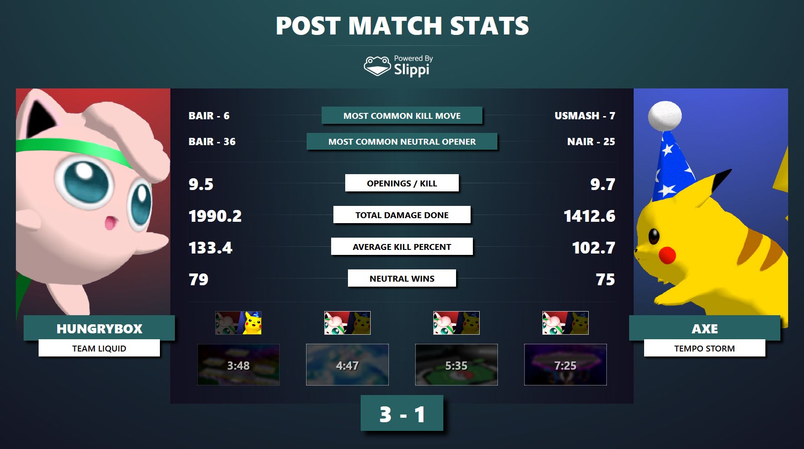
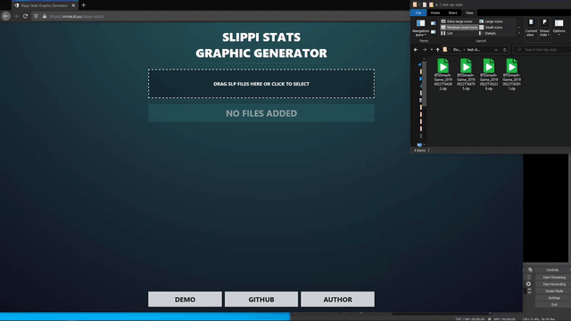

# Slippi Stats Graphic Generator

> Automatically generate Summit-style Slippi set stats. Say that 5 times.

Instantly compute Slippi stats and beautifully render the results. Perfect for both tournament broadcasts and competitors.

## Fork

This is a fork with the purpose of changing Slippi Stats Graphic Generator into an **app** that **automatically shows the result** when a match has ended. This makes it even more useful for tournaments, as 

## Usage

1. Download and open.
2. Enter the path where your .slp files will appear.

Now whenever a match is finished the application will automatically show the match results.

### Keeping files and merging stats

By checking `Keep files` it will keep all the stats files for you to watch back. For example, if you have three files, and another game ends, it will show the stats of the fourth game. You can press `2` to watch the stats of the second match. By pressing `0` you will see all these files merged. If you want to automatically see the stats of multiple matches merged, you can enable the `Merge stats` option. Note that `Merge stats` does nothing with `Keep files` disabled.

**Your settings are saved, even though the checkbox might be unchecked again.** The same counts for your Slippi path.

Some scenarios:

* You are playing friendlies, and want to show the stats after each game. You uncheck `Keep files` and `Merge files`.

* You have a tournament, and want to show the stats of each individual game. At the end you want show to statistics of the whole set. You check `Keep files` and uncheck `Merge files`. At the end of the set you press `0`.

* You have a tournament, and at the end you want show to statistics of the whole set. You check `Keep files` and check `Merge files`.

## Note

This is my first time working with React and Electron, so stuff is wack it but works. Feel free to make a pull request if you want to improve it.

## Screenshot



## Features

- Extremely fast offline stats computation
- Easy drag-and-drop into OBS
- Highly customizable
- Free and open source



## FAQ

### The detected winner is incorrect!

Determining who wins a game seems easy at first but once you consider the possibilities of LRAS and quitting out of games, it's actually non-trivial. If the detected winner is incorrect, you can fix the set count by clicking on the head-to-head images.


### How do I show different stats?

First click the *customize stats* button in the top right of the SLP file list to show the list of available stats. Then toggle the checkboxes to enable and disable certain stats from being calculated.


### How do I change the color scheme?

Expand the options panel at the bottom to show some more customization options.


### How do I remove the background in OBS?

Just add this to the Custom CSS in the source properties.

```css
body {
  background: none !important;
}
```

### Dragging the OBS button doesn't work!

If you're using Streamlabs OBS (SLOBS), or just can't get it to work in normal OBS, just copy the browser URL and create a new browser source as you normally would for a website.

### How does it work?

It reads your SLP files locally and does all the computation in-browser. Nothing is sent to any servers so this works offline too! This allows very fast Slippi game parsing so you can generate these graphics instantly.

## Development

### Setup

Install Electron

```bash
npm install -g electron
```

Clone the repo and install dependencies:

```bash
git clone https://github.com/vinceau/slippi-stats
cd slippi-stats
yarn install
```

In the project directory, you can run:

```bash
yarn electron:start
```

This runs the app in the development mode. Ignore that the browser opens <http://localhost:3000> (you can close it) and wait for the app to appear.. The app will reload as you make changes.

To build the app for production, run:

```bash
yarn electron:build
```

### Adding Custom Stats

You can add custom stats by extending the `StatDefinition` interface as defined in [`lib/stats/types.ts`](src/lib/stats/types.ts).

```typescript
export type StatCalculation = (games: GameDetails[], playerIndex: number) => StatCalculationResult;

export interface StatDefinition {
  name: string;
  type: string;
  betterDirection?: string;
  recommendedRounding?: number;
  calculate: StatCalculation;
}
```

See [`firstBlood.ts`](src/lib/stats/definitions/firstBlood.ts) and [`lCancelAccuracy.ts`](src/lib/stats/definitions/lCancelAccuracy.ts) for an example of custom stats implementations.

Once you have a custom stats definition, simply give it an ID in [`lib/stats/types.ts`](src/lib/stats/types.ts) and register the definition in [`lib/stats/compute.ts`](src/lib/stats/compute.ts).

## Acknowledgements

This project was made possible by:

- [Jas Laferriere](https://github.com/JLaferri) and [the team](https://slippi.gg/about) for Project Slippi

- [Jas Laferriere](https://github.com/JLaferri) for his [Slippi Set Stats](https://github.com/project-slippi/slippi-set-stats) script

- [BTS Smash](https://twitter.com/BTSsmash/) for their post-match stats design

- [David V. Kimball](https://twitter.com/davidvkimball) for the HD stage screenshots

## License

This software is released under the terms of [MIT license](LICENSE).
